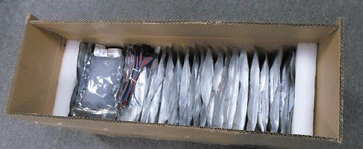

## LED strips

There was a need in fully controllable light source. Having experience with addressable LED modules like MegaBrite (http://macetech.com/store/index.php?main_page=product_info&products_id=9), this technology was choosen because of precise control of the light.

After a hard googling, a digital LED strip was found on Adafruit (https://www.adafruit.com/products/306). It has addressable control over each LED, with 7bit PWM per color and fast enough speed. It consists of RGB SMD 5050 LED and LPD8806 IC, having 32 LED per meter. I have already had experience with a previous model with HL1606 chip but HL1606 was too slow and had poor pwm capabilities.
5 meters for tests were ordered.

## Controller
After tests with Arduino and LPD8806 strip, it was discovered that the line that is longer than 4.5m can't be controlled with sended from the app bitmaps, because Arduino runs out of memory, when storing frame is bigger then 150 pixels or even less depending on size of programm executes on Arduino.
But there was a need to control 75 meters of the strips. Searching for solution continued and PixelPi software (https://github.com/scottjgibson/PixelPi) was found, it works on Raspberry Pi. RPI was setuped for receiving bitmaps from software via UDP, each frame came in one UDP packet. 

## Ordering and preparation
100 meters of LPD8806 strips were ordered from China when tests was finished. 75 m for the object and 25 for insurance.

http://youtu.be/b4VB9Szu8UU

Before intallation all fifteen rolls were cutted in the middle, soldered with connectors and additional power supply wires. Because each meter use 2A 5V better supply them as frequently as possible, manufacture recomends connect every 5 meters rigth to the power supply.
