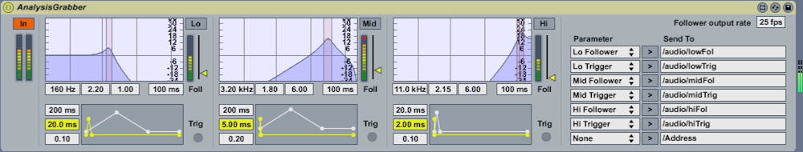

## Interaction

To create an interaction with the visitors of the objects space, it was planned to use Kinects, placed in the top triangle of icosahedron. After tests was found out that 2 Kinects would be enough to grab all the needed space. Standalone app to detect people coming inside the object was created. It is based on one of examples from ofxCV addon (https://github.com/kylemcdonald/ofxCv) and ofxCv::ContourFinder class with some modifications. App transfers data about people position to main app using OSC, in Icosahedron app data are interpreting to right GL positions. These coordinates create spheres around the visitors.

contourFinder app can be found in project_code folder.

In further development, going to get 4 farthest points from the center of detected man's contour to add precice to interaction with virtual objects.

Ableton and max4live patch Livegrabber (http://showsync.info/index.php/tools/livegrabber/) was used to manage the audio input and sent the controlling data to Icosahedron app via OSC. The Livegrabber plugins are a set of free Max For Live plugins, they send actions from Ableton Live to any device on the network that supports Open Sound Control (OSC). This pack contains AnalysisGrabber - tool for analysing frequency response with ability to send each parameters data on the configurable address. Low, Mid and Hi values were routed to colors alpha channel in Icosahedron app. Trig functions were used for triggering events.

