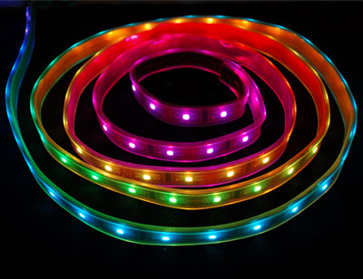
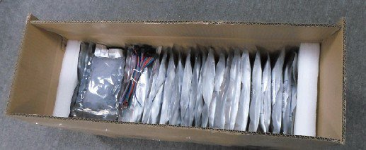

## Electroinics

There was a need in fully controllable light source. Having experience with addressable LED modules like ShiftBrite, was choosen to use this technology for preciese control of light.

After hard Googling, on Adafruit was found LED strip (https://www.adafruit.com/products/306), that has addressable control over each LED, with 7bit PWM and fast enough speed. It consists from SMD 5050 LED and LPD8806 IC, having 32 LED per meter. I had experience with previous model with HL1606 chip, but it was too slow and had poor pwm capabilities.
Ordered 5 meters for tests. After tests with Arduino and LPD8806 strip, discovered that line longer then 4.5m can't be controlled with sended from the app bitmaps, because Arduino runs out of memory when storing frame bigger then 150 pixels, or even less depending on size of programm running on Arduino. Searching for solution continued and was found PixelPi software (https://github.com/scottjgibson/PixelPi) for Raspberry Pi, and it worked. RPI was setuped for receiving bitmaps from software via UDP, each frame came in one UDP packet. 

100 meters of LPD8806 strips was ordered from China, when tests was finished.

http://youtu.be/b4VB9Szu8UU