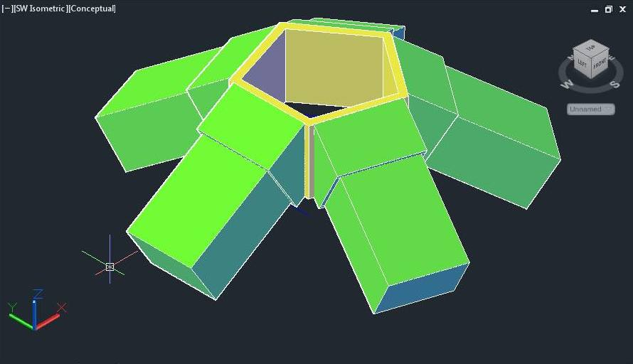
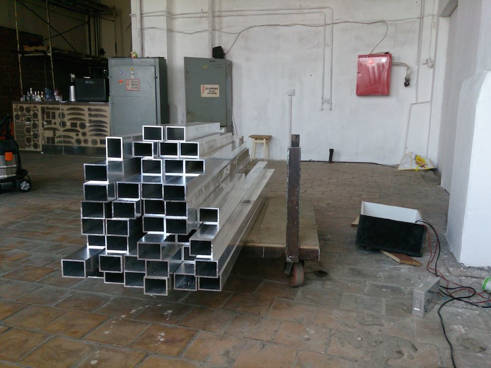
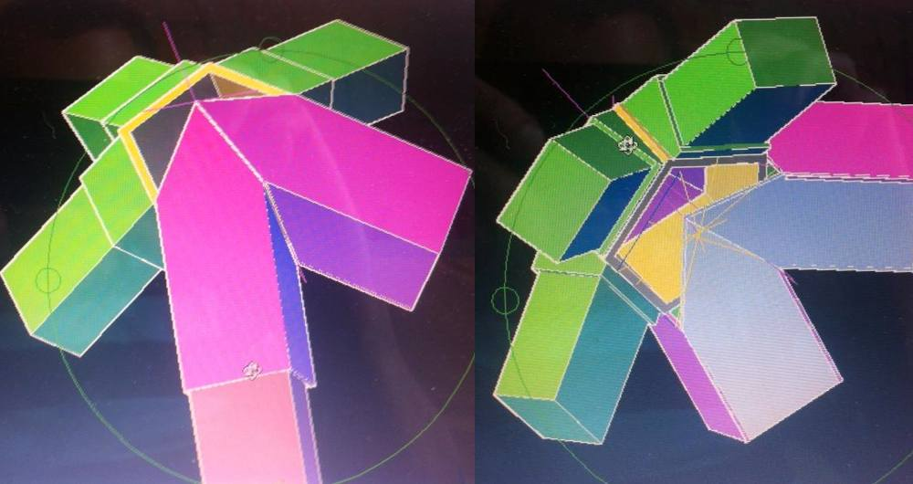
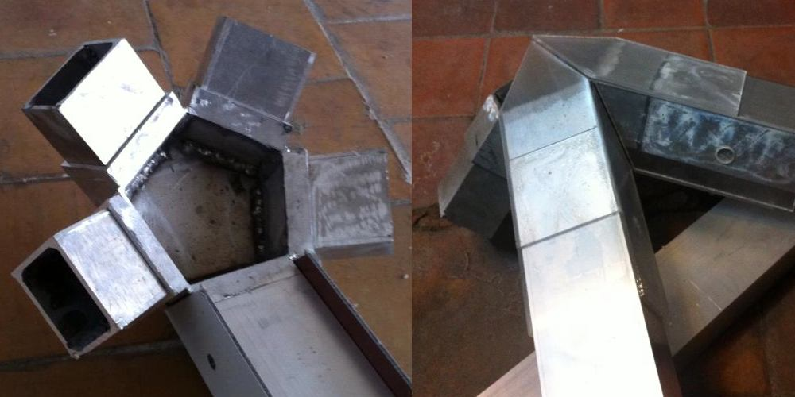

## Hardware

Aluminium was choosed as main material of installation because of it's light and strength. Found tubes with right dimesion, they had rectangle form with width bigger then height, so we could place LED strips inside, close them on sides with composite material with custom texture and on top with satin plexiglass. Was decided to make edges 2.5 meters long, because of supplied tubes and LED strips selling in 5 meter rolls.

Hardest part was vertex welding, it took really alot of time and even one finger of welder (
Because of low budget, they were contructed from separate alum parts, not from one piece of aluminium.

After they were done, and was tried to pull tybes on them, happened that they are to tightly fitted, and vertexes were polished to more pyramidal shape.

Then composite material and plexiglass was sent to milling with no problems { till final contruction )) }.