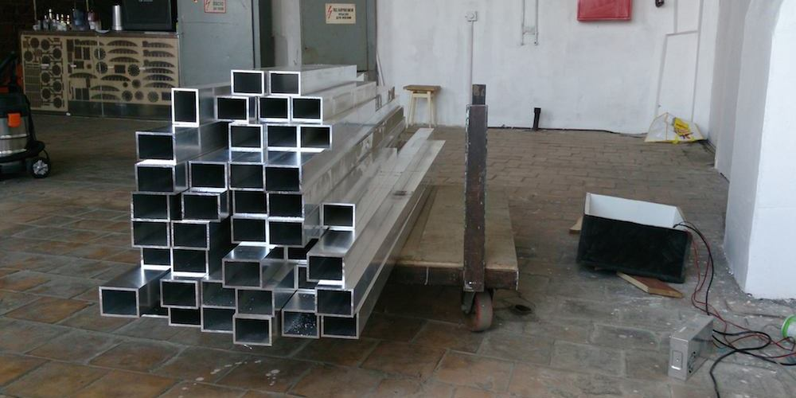

## Hardware

Aluminium was chosen as main material of installation because of it's lightweight and strength. Found tubes with right dimension, they had rectangle form with width bigger than height, so we could place LED strips inside, close them on sides with composite material and on top with satin plexiglass. Was decided to make edges 2.5 meters long, because of supplied tubes and LED strips sold in 5 meter rolls.

Hardest part was vertex welding, it took really a lot of time and even one finger of welder (
Because of low budget, they were constructed from separate alum parts, not from one piece of aluminium.

After vertices were done, and was tried to pull tubes on them, happened that they are too tightly fitted, and vertices were polished to more pyramidal shape.

After additional measurements composite material and plexiglass was sent to milling with no problems { till final construction )) }.
