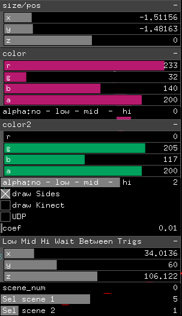

## Software

Based on previous experience of development, openFrameworks was chosen as the main tool. Taking into account that the 3D simulation is needed and all the OpenGL functions are available, OF was a good decision to study GL and the things it can do. The first problem was to find places  where virtual interactive objects cross icosahedrons wireframe edges and then get color from right pixels. The answer was constructive solid geometry (CSG) - a technique that is used in solid modeling. 


In OpenGL it can be achieved while using Stencil Buffer (http://en.wikibooks.org/wiki/OpenGL_Programming/Stencil_buffer)
Here is the code for drawing a scene in icosahedron:

```
    glClear(GL_DEPTH_BUFFER_BIT);
    glEnable(GL_STENCIL_TEST);
    glColorMask(GL_FALSE, GL_FALSE, GL_FALSE, GL_FALSE);
    glDepthMask(GL_FALSE);
    glStencilFunc(GL_NEVER, 1, 0xFF);
    glStencilOp(GL_REPLACE, GL_KEEP, GL_KEEP);  // draw 1s on test fail (always)
    
    // draw stencil pattern
    glStencilMask(0xFF);
    glClear(GL_STENCIL_BUFFER_BIT);  // needs mask=0xFF
    
    icoMesh.draw(); // DRAW ICOSAHEDRON
    
    glColorMask(GL_TRUE, GL_TRUE, GL_TRUE, GL_TRUE);
    glDepthMask(GL_TRUE);
    glStencilMask(0x00);
    // draw where stencil's value is 0
    glStencilFunc(GL_EQUAL, 0, 0xFF);
    /* (nothing to draw) */
    // draw only where stencil's value is 1
    glStencilFunc(GL_EQUAL, 1, 0xFF);
    
    drawScene(false); // DRAW SCENE WITH OTHER OBJECTS
    
    glDisable(GL_STENCIL_TEST);
```
To grab each edge, it was decided to use 12 gl cameras placed around object to catch a state of 12 different sides of Icosahedron and to grab 30 edges. Far clip of each camera was configured with a value that cuts everything behind the surface of the icosahedron side, it was a kind of slicing.


12 cameras means that scene must be rendered 12 times to grab camera's views and once for a main view. So app worked on speed around 25 fps. Now there I have an idea how to optimize it using 4 cameras or even two if I can configure right Field Of View (FOV).

For pixels grabbing GL camera worldToScreen matrix manipulation was used, so after all the cameras capture their sides, app grabs 2D image and gets colors of pixels in appropriate positions. Grabbed sides can be seen in the left top corner of the screenshot.


Scene manager was developed for changing scenes with different objects and their behaviour. In GUI pannel its interface marked as "Sel scene 1" and "Sel scene 2", color for current selected scenes can be set in "color" and "color2" respectively. The alpha channel can be controlled manually or with a value of Low/Mid/Hi audio frequencies. Every scene consists of different objects with different reactions on audio and time events.

