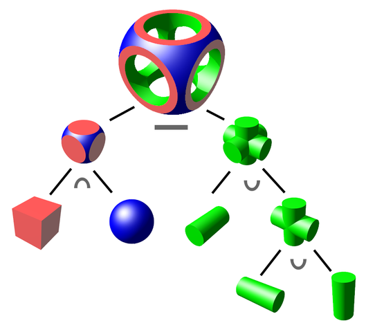
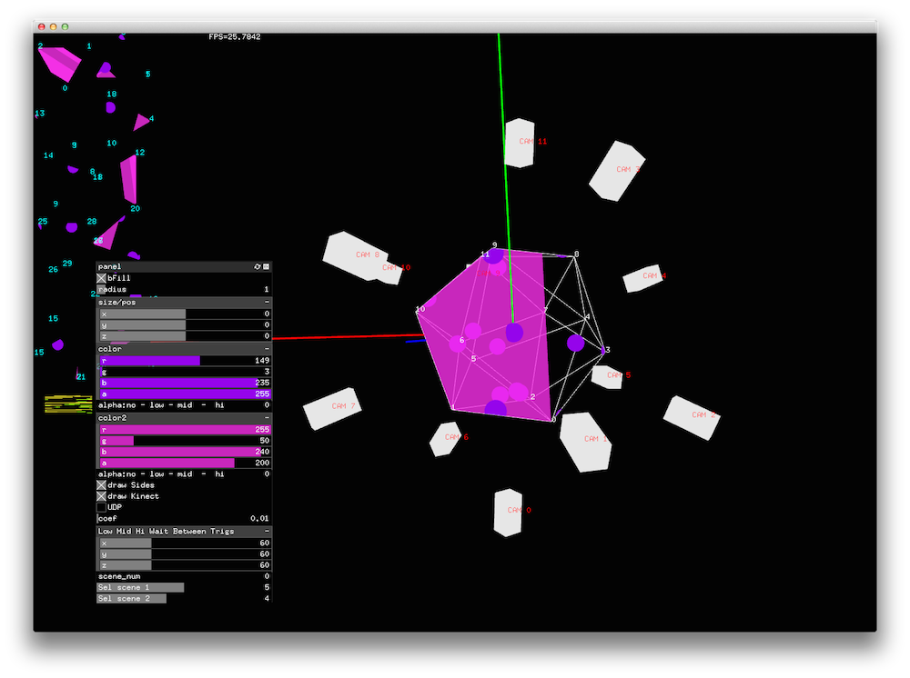

## Software

Based on previous experience of development, as main tool was chosen openFrameworks. Understood that 3D simulation needed and there are all OpenGL functions available, it was good choice to learn GL and things it can do. First problem was how to find places where virtual interactive objects cross icosahedrons wireframe edges and then get color from right pixels. Answer was constructive solid geometry (CSG) - technique used in solid modeling. 

In OpenGL it can be achieved using Stencil Buffer (http://en.wikibooks.org/wiki/OpenGL_Programming/Stencil_buffer)
Here is code to draw scene in icosahedron

``
    glClear(GL_DEPTH_BUFFER_BIT);
    glEnable(GL_STENCIL_TEST);
    glColorMask(GL_FALSE, GL_FALSE, GL_FALSE, GL_FALSE);
    glDepthMask(GL_FALSE);
    glStencilFunc(GL_NEVER, 1, 0xFF);
    glStencilOp(GL_REPLACE, GL_KEEP, GL_KEEP);  // draw 1s on test fail (always)
    
    // draw stencil pattern
    glStencilMask(0xFF);
    glClear(GL_STENCIL_BUFFER_BIT);  // needs mask=0xFF
    
    icoMesh.draw(); // DRAW ICOSAHEDRON
    
    glColorMask(GL_TRUE, GL_TRUE, GL_TRUE, GL_TRUE);
    glDepthMask(GL_TRUE);
    glStencilMask(0x00);
    // draw where stencil's value is 0
    glStencilFunc(GL_EQUAL, 0, 0xFF);
    /* (nothing to draw) */
    // draw only where stencil's value is 1
    glStencilFunc(GL_EQUAL, 1, 0xFF);
    
    drawScene(false); // DRAW SCENE WITH OTHER OBJECTS
    
    glDisable(GL_STENCIL_TEST);
``
To grab each edge, decided to use 12 gl cameras placed around object, to catch state of 12 different sides of Icosahedron and grab 30 edges. Far clip of each camera was configured with value that cuts everything behind surface of icosahedron side, it was kind of slicing.

But 12 cameras means, that scene must be rendered 12 times to grab cameras views and one time for main view. So app worked on speed around 25 fps. But now got idea how to optimize it using 4 cameras, or even two if can config right Field Of View (FOV).

For pixels grabbing was used GL camera worldToScreen matrix manipulation, so after all cameras captured theirs sides, app grabs 2D image and get color of pixels in needed positions. Grabbed sides can be seen in left top corner of screenshot.

