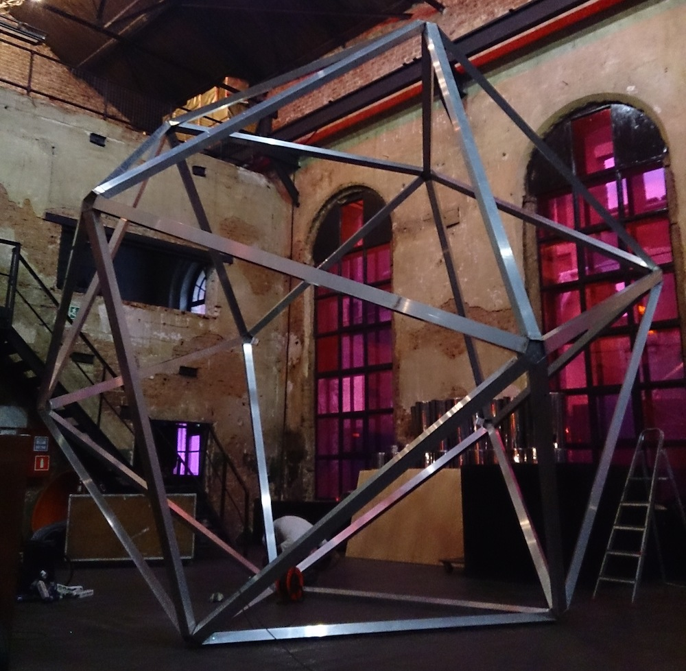
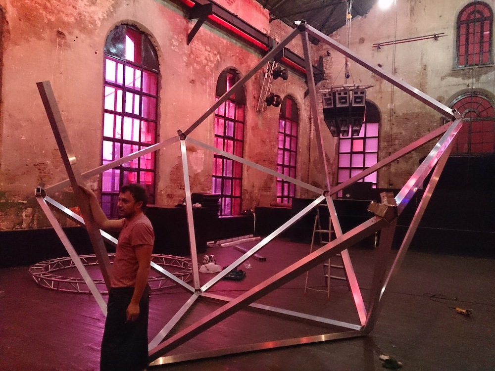
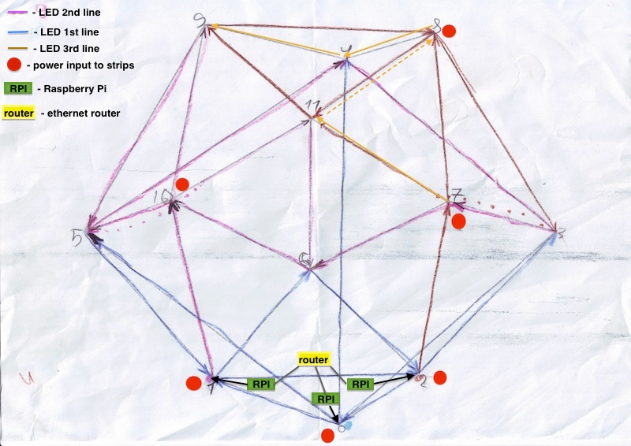

## Construction

This was one of the most admiring and the hardest part. All parts of project was produced and separately tested a week before the event. Because of the club schedule of events parts was brought on location on monday night and we had time to construct everything till saturday night.
On tuesday morning we started to built. It took around 14 hours to built aluminium frame. Five men were rolling frame all around dancefloor to push edges inside vertices, using weight of the object. Each edge was fixed with screws after putting in. Pulling the last edge was the most exciting part.
Assembling of composite material started the next day. All LED strips were tested once again.

http://youtu.be/DTPLMKVu_6U

