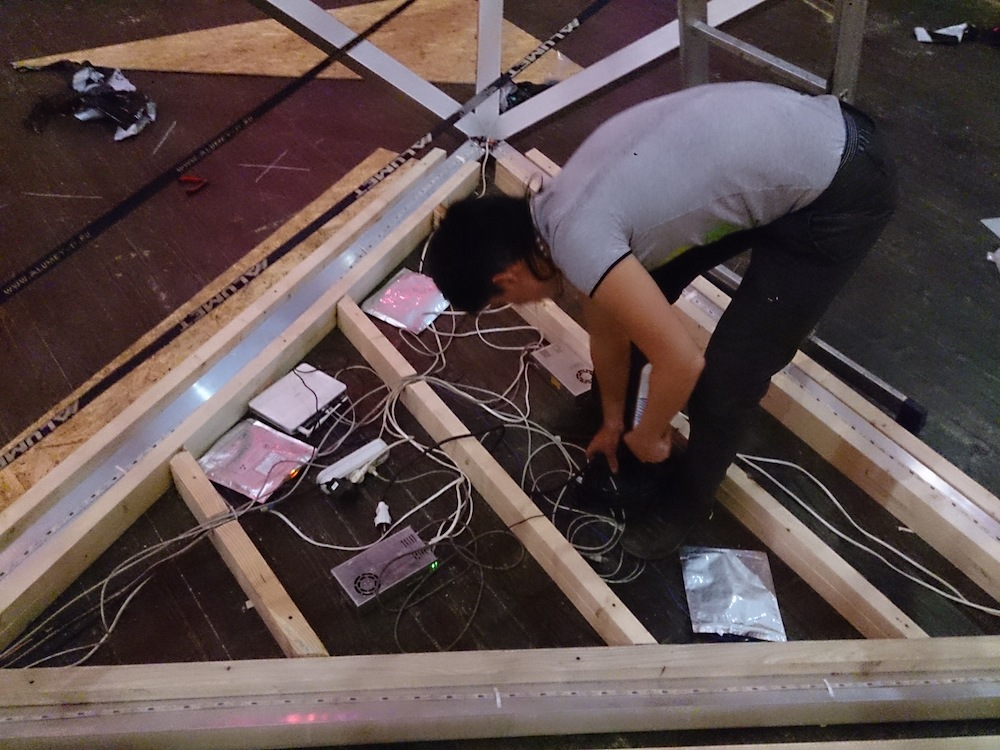

## Construction

This was the most exciting and the hardest part. All parts of project was produced and tested separately a week before the event. Parts was brought on location only on Monday night because of the clubs schedule of events. So we had got time to construct everything till the Saturday night.

On the Tuesday morning we started to built. It took around 14 hours to built aluminium frame. Five men were rolling frame around the dancefloor to push edges inside vertices using weight of the object. Sad that there ain't no video, it was really fun. Each edge was fixed with screws after pushing. Connecting of the last edge was the most exciting part.


Mounting of composite material started the next day. All LED strips were tested once again. We have finished mounting composite material at the late night.

On the Thursday I started to connect strips according to the connection map. I decided to use 3 Raspberry Pi for easy routing and for increasing speed margin.


There is special variable in software that defines the order of sides to grab. And strips was connecting in the same order. At first I've tested 1st LED line (blue one), made little fixes and it worked. But it turned out that plexiglass didn't glue with edges of composite material and we needed to find the solution. We have stopped mounting LED strips.

```c++
const ofVec2f icoGrabSides[] = {
    ofVec2f(0, 1),
    ofVec2f(1, 2),
    ofVec2f(2, 0),
    ofVec2f(0, 5),
    ofVec2f(5, 1),
    ofVec2f(1, 6),
    ofVec2f(6, 2),
	ofVec2f(2, 3),
	ofVec2f(3, 0),
    ofVec2f(0, 4), // 10 sides
    
	ofVec2f(1, 10),
	ofVec2f(10, 9),
	ofVec2f(9, 5),
	ofVec2f(5, 4),
	ofVec2f(4, 3),
	ofVec2f(3, 7),
    ofVec2f(7, 6),
    ofVec2f(6, 10),
    ofVec2f(10,5), // 5 drop to 10
    ofVec2f(10,11),
    ofVec2f(11,6), // 11 sides
    
    ofVec2f(2, 7),
    ofVec2f(7, 8),
    ofVec2f(8,11),
    ofVec2f(11,9),
    ofVec2f(9, 8),
    ofVec2f(8, 3), // 3 drop to 7
    ofVec2f(7,11), //11 drop to 8
    ofVec2f(8, 4),
    ofVec2f(4, 9), // 9 sides
};

const ofVec3f icoVerts[] = {
    ofVec3f(0.000f,  0.000f,  1.000f),
    ofVec3f(0.894f,  0.000f,  0.447f),
    ofVec3f(0.276f,  0.851f,  0.447f),
    ofVec3f(-0.724f,  0.526f,  0.447f),
    ofVec3f(-0.724f, -0.526f,  0.447f),
    ofVec3f(0.276f, -0.851f,  0.447f),
    ofVec3f(0.724f,  0.526f, -0.447f),
    ofVec3f(-0.276f,  0.851f, -0.447f),
    ofVec3f(-0.894f,  0.000f, -0.447f),
    ofVec3f(-0.276f, -0.851f, -0.447f),
    ofVec3f(0.724f, -0.526f, -0.447f),
    ofVec3f(0.000f,  0.000f, -1.000f)
};
```

http://youtu.be/DTPLMKVu_6U

On the Friday we had to order additional plastic strips to glue them to the composite material and then glue plexiglass over the top. They were ready in the evening and we spent all night gluing them on the composit. LED strips were glued after plastic strips and been connected.

On image you can see that light don't fill the entire surface of Plexiglass because of plastic strips inside.

So on the Saturday, we connected all needed communications and tested everything once again, then glued Plexiglass over the top. After that we closed all electronics in the lower side of icosahedron, and made kind of podium inside. We have finished it at 10 pm and I had two hours to polish scenes and test audio input.




