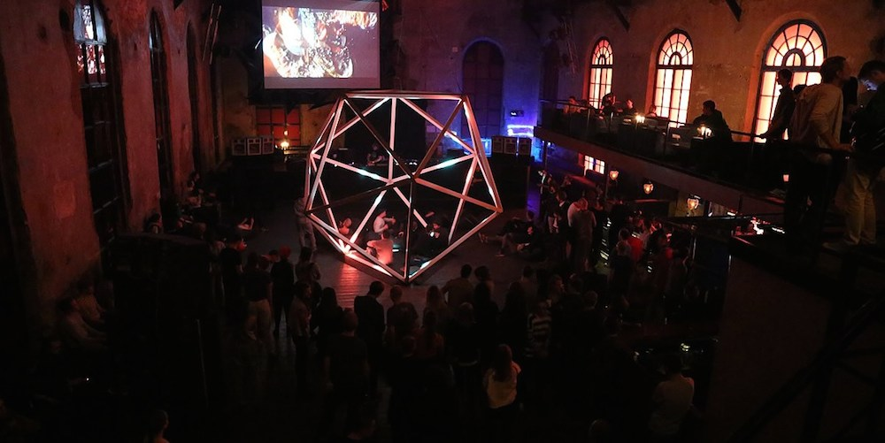

# Icosahedron

## Authors
- Tim Tavlintsev, https://github.com/techtim
- Anton Podkopaev

## Description
Research of possibility of creating physical space, where virtual 3D scene will cross reality, not in usual 2D projection, but in three dimensional physical space. Virtual space creates in custom made software using openFrameworks. Space consists Icosahedron object itself with simple geometric shapes (pyramids, spheres, cubes, etc.) that moves around and deforms, depending on real word factors, for example sounds or human position inside space. On the real object light appears in places where shapes cross wireframe of virtual Icosahedron. Audience dive into the space that never exists before, becouse light forms our perceive of it. Interesting to explore how this 3d space can interact and deliver emotional feedback to audience inside it.

## Link to Prototype
[Project Page](http://tvl.io/project/projecticosahedron "Project Page")

## Example Code
Capturing of sides states uses OpenGl Stencil buffer to cut scene with icosahedron volume
```
void testApp::drawInIco() {
    glClear(GL_DEPTH_BUFFER_BIT);
    glEnable(GL_STENCIL_TEST);
    glColorMask(GL_FALSE, GL_FALSE, GL_FALSE, GL_FALSE);
    glDepthMask(GL_FALSE);
    glStencilFunc(GL_NEVER, 1, 0xFF);
    glStencilOp(GL_REPLACE, GL_KEEP, GL_KEEP);  // draw 1s on test fail (always)
    
    // draw stencil pattern
    glStencilMask(0xFF);
    glClear(GL_STENCIL_BUFFER_BIT);  // needs mask=0xFF
    icoMesh.draw();
    
    glColorMask(GL_TRUE, GL_TRUE, GL_TRUE, GL_TRUE);
    glDepthMask(GL_TRUE);
    glStencilMask(0x00);
    // draw where stencil's value is 0
    glStencilFunc(GL_EQUAL, 0, 0xFF);
    /* (nothing to draw) */
    // draw only where stencil's value is 1
    glStencilFunc(GL_EQUAL, 1, 0xFF);
    
    drawScene(false);
    
    glDisable(GL_STENCIL_TEST);
    
}
```

[openFrameworks](https://github.com/openframeworks/openFrameworks "openFrameworks")
[ofxOsc](https://github.com/roxlu/ofxOsc "ofxOsc")
[ofxKinect](https://github.com/ofTheo/ofxKinect‎ "ofxKinect‎")
[ofxCv](https://github.com/kylemcdonald/ofxCv "ofxCv")
[OpenCV](https://github.com/Itseez/opencv "OpenCV")
[PixelPi](https://github.com/scottjgibson/PixelPi "PixelPi")

## Images & Videos

http://www.youtube.com/watch?v=3AoSZ6N3uQk




## Conclusion
Working on this project I've spent the third part of the time Googling, I didn't have anybody near who could answer my questions, I didn't know how to use OpenGL or what kind of technologies to use. I was searching, reading and searching again, aggregating knowledge and technologies in my head. It took me about half of a year on researching and learning. Google Search was one of the main instruments for creating Icosahedron. Xperia Z with Andriod was used for additional OSC control. Don't think that the full potential of the idea was realised. The club wasn't the best location for installation, too much additional light outside the object and the audience concentrated on music. Small amount of time didn't offer me callibrate everything and explore available possibilities, the installation lived only for 12 hours while the party was going on.

## Further development
Place Icosahedron in the dark space where only the object itself produces light.
Advanced interaction between the visitors and the virtual objects with feedback in the form of light and sound.
Few microphones to listen to the environment.
Additional sound design for Icosahedrons virtual events.
All this will provide full immersion of the audience into the place where virtual space crosses reality.
